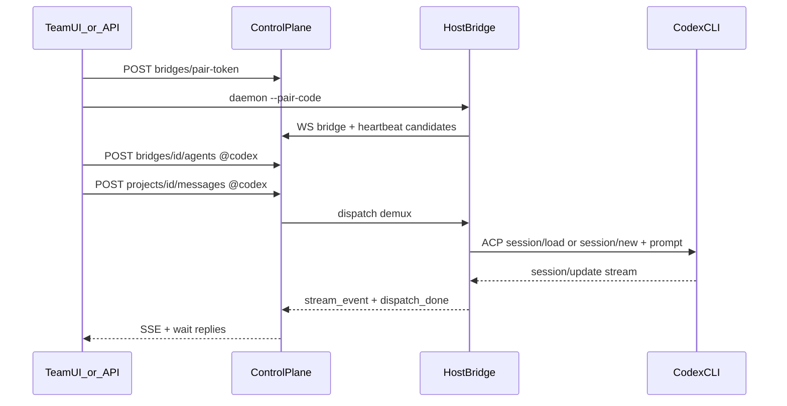

# Agent Team 端到端测试流程

> 版本：v1.0 | 日期：2026-08-07  
> 前置：[Agent_Team_PhaseA_实现规格.md](Agent_Team_PhaseA_实现规格.md)、[Agent_Team_Host_Bridge架构.md](Agent_Team_Host_Bridge架构.md)  
> 自动化入口：[`scripts/e2e_team_codex.py`](scripts/e2e_team_codex.py)  
> UI：独立仓库 `ms-agent-webui` → `/team`

---

## 目标与边界

证明 Phase A 三句话：**派得到 · 看得住 · 收得回**。

| 路径 | 角色 | 说明 |
|------|------|------|
| **Codex ACP** | 主路径（必过） | `codex-acp` 长驻 ACP → `session/load\|new` → `@codex` |
| Cursor CLI | 对照 | `agent acp`；需 `agent login` |
| Claude ACP | 对照 / 可 SKIP | `claude-agent-acp` / `claude acp`；`SKIP_CLAUDE=1` |
| Cursor IDE / 交互 TUI | **不验收** | 不是 ACP 进程，不可附着 |
| Hermes / OpenClaw / 钉钉必做 | **不验收** | 钉钉可 WoZ |



---

## 0. 环境门禁（每次开测前）

| 检查 | 命令/条件 | 通过标准 |
|------|-----------|----------|
| Backend | `curl -sS http://127.0.0.1:8000/api/health` | 200；`MS_AGENT_TEAM_ROOT` 指向本仓库 |
| Team 路由 | `GET /api/v1/team/bridges` | 200（非 404） |
| 旧 pair 废弃 | `POST /api/v1/team/endpoints/pair-token` | **410** |
| Codex ACP | `codex-acp` 或 `npx @agentclientprotocol/codex-acp` | discover `codex.available=True` |
| Codex 登录 | `~/.codex/auth.json` 或 ChatGPT/API login | 未登录 → `need_reauth`（不塞 Team `.env` key） |
| PATH | daemon 能找到 `npx`/`codex-acp`/`codex` | Bridge 子进程可起 ACP |
| Frontend（UI 段） | `ms-agent-webui` Vite 代理 8000 | `/team` 可打开 |

约定：

- `owner_user_id=u1`
- 每次测试使用唯一 `machine_label`（如 `e2e-$timestamp`），避免历史 Bridge 同名干扰
- 主路径 **禁止** `--dry-run`

脚本会自动跑「Backend / Team / 410 / Codex which」子集；网络探测可用 `E2E_CHECK_CODEX_NET=1`。

---

## 1. 自动化冒烟（API + daemon）

```bash
# 依赖：backend 已在 :8000，且挂载了本仓库 Team
export PYTHONPATH="/Users/luyan/workspace/modelscope-agent:/Users/luyan/workspace/modelscope-agent/webui/backend"
export PATH="$HOME/.nvm/versions/node/v24.13.0/bin:$PATH"

python scripts/e2e_team_codex.py
# 常用开关：
#   SKIP_ATTACH=1      跳过 T5
#   SKIP_CANCEL=1      跳过 T6
#   SKIP_CLAUDE=1      跳过 Claude 对照（默认 1）
#   SKIP_CURSOR=1      跳过 Cursor 对照（默认 1）
#   E2E_TIMEOUT=180    派工 wait 秒数
#   E2E_API_BASE=http://127.0.0.1:8000
```

### T1 — Pair + online

1. `POST /api/v1/team/projects`（`default_lead_at=codex`）
2. `POST /api/v1/team/bridges/pair-token`
3. 启动：

```bash
python -m ms_agent.bridge.daemon \
  --api-base http://127.0.0.1:8000 \
  --pair-code <code> \
  --machine-label e2e-$ts \
  --no-auto-me \
  --cwd <repo>
```

4. 轮询 `GET /bridges?owner_user_id=u1` 直到该 label `status=online`（≤30s）

**Pass**：Bridge online；daemon 日志有 `registered`。

### T2 — Discover candidates

1. `GET /bridges/{id}/candidates`

**Pass**：至少含 `runtime=codex` 且 `attachable=true`；若有 `~/.codex/sessions`，可见带 `runtime_session_id` 的会话候选；可出现 `cursor_ide` 且 `attachable=false`。

### T3 — Enable Agent

1. `POST /bridges/{id}/agents`：`at_name=codex`, `runtime=codex`, `adapter_kind=acp`, `status=online`
2. 再启用 `@me`（同 runtime）验证多 Agent 同 Bridge（S3）

**Pass**：200；列表含 `@codex` 与 `@me`；同 owner 重绑不 409。

### T4 — Dispatch fresh（主验收）

1. `POST /projects/{id}/messages?wait=true&wait_timeout=…`  
   content：`@codex Reply with exactly the single word PONG and nothing else.`  
   `session_mode=fresh`

**Pass**：有 dispatch；`replies` 中 `@codex` 有成功回包（含 `PONG` 或非空成功摘要）。

### T5 — Dispatch attach

1. 使用 T2 中某 `runtime_session_id`（或 `SKIP_ATTACH=1` 跳过）
2. `session_mode=attach`，期望 ACP `session/load`；失败必须 `session_attach_failed`（默认禁止静默 fresh）

**Pass**：回包成功且模式为 attach；若 resume 失败须有明确错误 / `attach_fallback_fresh`，禁止静默当成功。

### T6 — Cancel

1. 发长任务 `@codex`（不 wait 或短 wait 前先 cancel）
2. `POST /dispatches/{id}/cancel`

**Pass**：取消被接受；后续状态为 cancelled（或等价回执）。

### T7 — 失败态矩阵

| 用例 | 操作 | 期望 | 脚本 |
|------|------|------|------|
| 旧 API | `POST /endpoints/pair-token` | 410 | 门禁自动 |
| 未登录 Cursor | 启用 `@cursor` 并派工 | `need_reauth` / Authentication | `SKIP_CURSOR=0` |
| Claude 拦截 | `@claude` | 明确 error；可 SKIP | `SKIP_CLAUDE=0` |
| Bridge 断开 | kill daemon 后再派工 | offline / 派工失败可见 | 人工或脚本尾声 |
| at_name 异主冲突 | 另一 owner 抢名 | 409 | 可选人工 |

---

## 2. UI 人工验收（`ms-agent-webui` `/team`）

| 步骤 | 操作 | Pass |
|------|------|------|
| U1 | 新建 Team 项目 | 可选中 |
| U2 | 「生成连接命令」→ 本机执行 daemon | Bridges → online |
| U3 | Candidates 出现 Codex / 会话 → 启用 `@codex` | Agent 可点选 |
| U4 | 发送 `@codex …` | 回包 + Events SSE |
| U5 | 切换 attach / fresh | dispatch 元数据一致 |
| U6 | 取消上次派工 | 状态更新 |

---

## 3. Spike 对齐（规格 S1–S3）

| Spike | 本流程 |
|-------|--------|
| S1 attach | T5；结论决定是否默认 attach |
| S2 health | T7 Bridge 断开 |
| S3 多 Agent | T3 `@codex` + `@me` 同 `bridge_id` |

---

## 4. 报告模板

```
日期 / commit / 环境网络：
门禁：PASS|FAIL|BLOCKED
T1–T6：PASS|FAIL|SKIP + 证据（bridge_id / dispatch_id / reply 摘要）
T7：逐条
U1–U6：PASS|FAIL|SKIP
阻塞：Codex 网络 / 登录 / PATH …
结论：主卖点三句是否仍成立（派得到 / 看得住 / 收得回）
```

### 首份实跑记录

见文末「附录：首份实跑报告」（由 `scripts/e2e_team_codex.py` 跑完后填写）。

---

## 5. 相关代码

| 组件 | 路径 |
|------|------|
| Host Bridge daemon | `ms_agent/bridge/daemon.py` |
| Codex adapter | `ms_agent/bridge/adapters/codex_cli.py` |
| Discovery | `ms_agent/bridge/discovery.py` |
| Bridges API | `webui/backend/team/api_bridges.py` |
| Team UI | `ms-agent-webui/frontend/app/routes/team.tsx` |
| E2E 脚本 | `scripts/e2e_team_codex.py` |

---

## 附录：首份实跑报告

> 由 `E2E_UPDATE_DOC=1 python scripts/e2e_team_codex.py` 自动更新。

```
日期：2026-08-07T16:10:19+08:00
commit：2d967b60
环境网络：API_BASE=http://127.0.0.1:8000 CHECK_NET=False
门禁：gate.health=PASS, gate.bridges=PASS, gate.old_pair_410=PASS, gate.codex_acp=PASS, gate.codex_auth=PASS
T1：project=PASS; pair_token=PASS; online=PASS
T2：candidates=PASS
T3：enable_codex=PASS; enable_me=PASS; rebind=PASS
T4：fresh=PASS
T5：attach=PASS
T6：cancel=PASS
T7：cursor=SKIP(SKIP_CURSOR=1); claude=SKIP(SKIP_CLAUDE=1)
阻塞：无
结论：主卖点三句成立（派得到 / 看得住 / 收得回）
```
